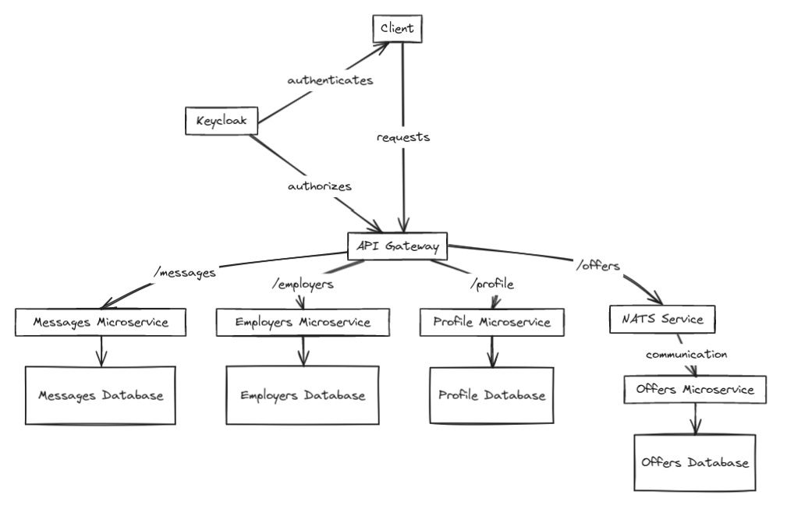

# Seasoning

[](LICENSE)

## Description

The **goal** of the application is to **put workers in relation with employers for seasonal jobs**. It simplifies the process of looking and applying for a job.

## Table of Contents

- [Installation](#installation)
- [Documentation](#documentation)
- [License](#license)
- [Authors](#authors)

## Installation

### Running the mobile app (./seasoning-front)

To manage to run the application, you either need an Android emulator like [Android Studio](https://developer.android.com/studio) or you can use [Expo](https://expo.dev/).

The last one is used to develop directly on your phone and is pretty convenient to install. As we used Expo, we are only going to explain how to run the project using Expo.

So to begin,

1. Install the **Expo** app installed on your device.
2. `cd ./seasoning-front` to go in the front-end related directory.
3. Copy the **modelEnv** file in .env and fill it like the following :

local
Use localtunnel with `lt --port 80`to proxy the gateway. See [LocalTunnel documentation](https://theboroer.github.io/localtunnel-www/)
And fill *xxx* with your url.
```env
EXPO_PUBLIC_BASE_URL=xxx
EXPO_PUBLIC_AUTH_URL=http://localhost/auth
```

production
```env
EXPO_PUBLIC_BASE_URL=http://api.araimbault.com
EXPO_PUBLIC_AUTH_URL=https://auth.araimbault.com
```

4. You can use `sudo npx expo start` to start the expo server.
5. Finally, just scan the QRCode that spawns in.

❗ You may need to add *--tunnel* argument in **step 3** if your computer and your phone are not connected to the same network.

### Running the gateway (./seasoning-api)

To run the gateway, copy the *modelEnv* file to .env.
Here is the configuration :

```env
# MICROSERVICES HOSTNAME
EMPLOYERS_MS_HOSTNAME=http://employers:8081
MESSAGES_MS_HOSTNAME=http://messages:8082
OFFERS_MS_HOSTNAME=http://offers:8083
PROFILE_MS_HOSTNAME=http://profile:8084

# RESSOURCE SERVER TO SSO
SSO_ISSUER_URL=https://auth.araimbault.com/realms/seasoning
SSO_JWT_SET_URI=https://auth.araimbault.com/realms/seasoning/protocol/openid-connect/certs
```

Depending on your configuration, it may be necessary to modify **SSO_JWT_SET_URI** & **SSO_ISSUER_URL** to point to your local Keycloak instance.


### Running the profile microservice (./seasoning-profile)

Profile microservice is already included in the docker-compose.yml in the root of the project ;)

### Running the offers microservice (./seasoning-offers)

To run, execute:
```shell
./gradlew bootRun
```
It will also run the Docker Compose file located at **./compose.yaml** used by this microservice
See more information [HERE](https://github.com/Hunh0w/Seasoning-Offers/blob/main/README.md)

## Documentation

### Microservices Architecture

The point of this project is to follow the microservices architecture approach. It consists of splitting the main components of the application as a suite of independently deployable, small, modular services. Each service runs a unique process and communicates between each others if needed.

#### Pros

- **Scalability**: Each service can be scaled independently, allowing better resource utilization.
- **Flexibility**: Services can be developed, deployed, and updated independently, facilitating faster development cycles.
- **Resilience**: Failure in one service doesn't necessarily affect others.
- **Technology Diversity**: Different services can use different technologies. This means technologies can be choosen accordingly to main function of the service.

#### Cons

- **Complexity**: Managing multiple services introduces complexity in deployment, testing, monitoring, and debugging.
- **Data Consistency**: Maintaining data consistency across services can be challenging, as the goal is to manage a database per service

### Architecture



### Technology Stack

#### React Native

React Native was a requirement for this project. It is a way to build native mobile application for both platforms (Android & iOS) at the same time. 
React Native allows developers to write mobile applications using React and JavaScript.

React Native is very popular, and because of that, it benefits from a large choice of libraries and tools. Avoid duplicating codebase for Android & iOS is also a great advantage. It avoids learning Kotlin and Swift, the other main way to make applications for both platforms.

NB : React Native can sometimes lead to complex UI designs. As it's not native developement, implementation can be harder to match both devices.

#### Spring Java

Spring is a popular open-source framework for building enterprise Java applications. It provides comprehensive infrastructure support for developing Java applications. It also was a requirement so we decided to use Spring Java for our gateway as our microservices.

As Java is one of the most popular programming language, it benefits from a large and active community providing support and resources. A lot of frameworks and modules are available to make your application modular.

The overuse of annotations can yet quickly became hard to understand for beginners.

#### Keycloak

Keycloak is an open-source identity and access management solution provided by Red Hat. It provides features such as single sign-on, authentication, authorization, and social login. For our project, we needed an authentication server to authenticate users. The choice was ether [Keycloak](https://www.keycloak.org/) or [Spring Security](https://spring.io/projects/spring-security).

Keycloak is quite complex to setup at first but provides a all-in-one solution for authentication, authorisation and other components that we do not use in our project.
As it's an isolated service, it's easier to scale and allow larger deployements.
It's designed to integrate easily with various authentication protocols and identity providers, making it suitable for a wide range of use cases and technologies.
It has also it's own UI, that is really helpfull as we start with Keycloak.

Even if Spring Security integrates easier with Spring applications, we choose Keycloak because of his scalability. As microservices aim for scalability and flexibility, Keycloak supports this goal by being scalable. However, Spring Security, despite its robust features and integration with the Spring ecosystem, may create bottlenecks due to its deep integration, potentially impacting scalability and performance under heavy loads."


#### PostgreSQL

PostgreSQL is a powerful open-source relational database management system known for its reliability, robustness, and support for advanced features.

As our data is structured and we need to ensure data integrity and consistency. SQL database is more suited for the task. ACID Transactions that provide this type of database fits perfectly our purpose.

#### NATS

NATS is a lightweight and high-performance messaging system for building distributed systems. It provides publish-subscribe and request-reply messaging patterns. It's perfectly suited for microservices architecture as it enables microservices to communicate in a decoupled and non-blocking manner, providing high performance, resilience and scalability.

As our time runs out, we tried to implement NATS only on the offers microservice to try it out.

❗ You have to note that complex routing could be hard to handle with NATS.


## License

This project is licensed under the [MIT License](LICENSE).

## Authors

- Adrien RAIMBAULT
- Vincent FONT
