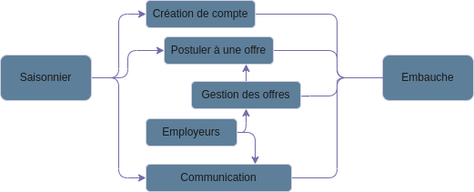
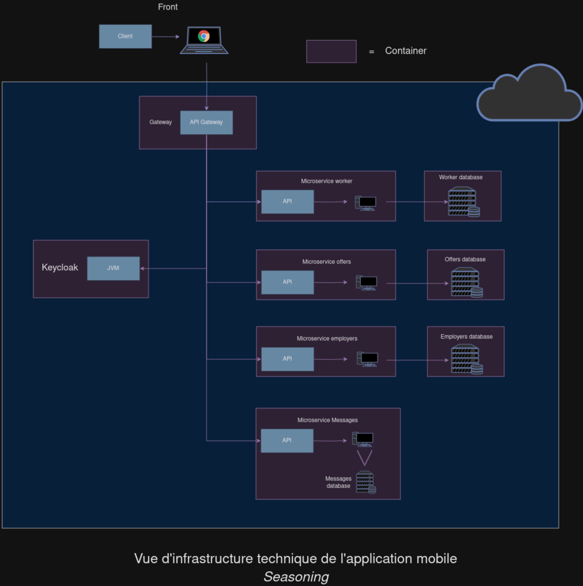

# Document d'architecture technique

## Introduction

Ceci est la vue applicative du projet. Elle décrit les modules applicatifs en jeu et leurs échanges.

Le glossaire du projet est disponible [Ici](glossaire.md). Nous ne redéfinirons pas ici les termes fonctionnels ou techniques utilisés.

## Contexte général

### Objectifs

Le but de cette application est de simplifier la mise en relation entre les employeurs et les saisonniers en recherche d'emploi. L'application offre une interface web mobile qui permet de facilement trouver un emploi correspondant aux contraintes du saisonnier.

### Planning

Le projet devra être évalué fin décembre pour être rendu dans les semaines qui suivent.
Des tests seront réalisés fin novembre afin de garantir la qualité du projet et la conformité avec les attendus.

## Contraintes

Voici un diagramme décrivant les fonctionalités à implémenter nécessaires au bon fonctionnement de l'application :

De plus, une API Gateway sera en charge des communications entre l'application web et les différents autres services.
Spring security et Keycloak seront utilisés pour garantir la sécurité de l'application lors de l'authentification.

## Architecture cible

### Architecture applicative générale

L'application mobile *Seasoning* est constituée de plusieurs micro-services indépendants.

Tous les micro-services se positionneront directement derrière une Gateway qui servira d'interface entre l'utilisateur et les microservices.

Keycloak est une partie également distincte de ces micro-services, ce qui signifie que chacun d'entre eux disposera de sa propre base de donnée afin de séparer les fonctions de ces services.

Voici un diagramme représentant toutes les fonctions nécessaires au bon fonctionnement de l'application :

### Architecture applicative détaillée

Voici plus en détails la liste des services :

#### **Application front-end : affiche l'interface de l'application**

#### **API Gateway : gère les communications entre l'application front-end et les différents micro-services**

#### **Micro-service des saisonniers : Gère les profils des saisonniers et toutes modifications relatives à celui-ci**

- GET /profile
- PATCH /profile
- DELETE /profile
- PUT /profile/cv
- PUT /profile/profilePicture

- POST /profile/experience
- POST /profile/reference
- POST /profile/disponibility

- PUT /profile/experience/:experience_id
- PUT /profile/reference/:reference_id
- PUT /profile/disponibility/:disponibility_id

- DELETE /profile/experience/:experience_id
- DELETE /profile/reference/:reference_id
- DELETE /profile/disponibility/:disponibility_id

- POST /profile/advice/worker/:worker_id
- POST /profile/advice/employer/:employer_id
- PUT /profile/advice/:advice_id
- DELETE /profile/advice/:advice_id

#### **Micro-service des offres : En charge de la gestion des offres et des opérations pouvant être réalisés**

- GET /offers
- GET /offer/candidatgère les données des saisonnierses
- POST /offer/candidate/:offer_id
- DELETE /offer/candidate/:offer_id
- PATCH /candidacy/:candidacy_id    (Used to modify the state of the candidacy)

#### **Micro-service des employeurs : Gère les données des employeurs**

- GET /employers

#### **Micro-service des messages : Manage les messages et les stocke en base de données**

- GET /messages (return last message sent to an employer in all conversations)
- POST /message/:employer_id

#### **Service [keycloak](https://www.keycloak.org/) : utilise OIDC pour gérer les demandes de connexion entrantes**

Ce service s'occupe des demandes de connexion et d'inscription. Il utilise le protocol OpenIDConnect pour fournir un JWT à l'utilisateur pour lui permettre de se connecter à l'application web mobile.  
[Spring security](https://spring.io/projects/spring-security), un framework Java, réceptionne le token du client et l'utilise dans les différents micro-services pour autoriser l'utilisateur à accéder à ces derniers.

## Technologies utilisées

### Front-end

Pour le front-end nous avons utilisé [React native](https://reactnative.dev/), un framework multiplateforme pour le développement d'applications mobiles qui permet aux développeurs de créer des applications performantes en utilisant JavaScript et React, favorisant la réutilisation du code sur les plateformes iOS et Android. Il est populaire pour son efficacité, sa rapidité et sa capacité à rationaliser les processus de développement et c'est pour ces simplicités que nous l'avons utilisé.

### API Gatway

L'API Gateway est rédigée en JAVA et utilise le framework Spring qui simplifie le développement d'applications en fournissant des fonctionnalités étendues, telles que l'inversion de contrôle et la gestion des transactions, favorisant la modularité et la flexibilité du code. Malgré sa courbe d'apprentissage complexe, ce framework permet une modularité et une facilité de développement.

### Communications entre services

Nous utilisons [GRPC](https://grpc.io/), qui utilise HTTP/2 pour communiquer entre nos différents services. Il offre un grande simplification des appels HTTP et sur le partage d'interfaces (de contrats) et évite les mauvaises compréhensions et clarifie les échanges lors du développement du front-end et du back-end.

Néamoins, avec la nécessité de vouloir communiquer de manière asynchrone, nous utiliserons un broker de messages comme Kafka lors des communications avec le service de messagerie. Ce genre de technologie est plus résiliente et plus fiable et nous permet de gérer certaines erreures liées aux requètes HTTP classiques.

