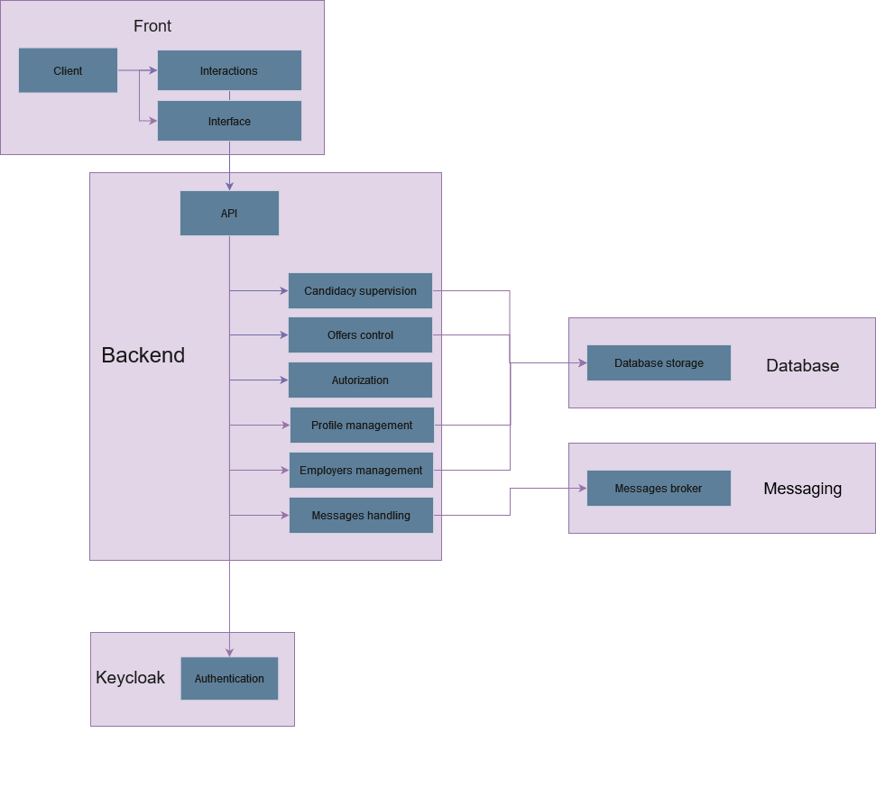

# Technical Architecture Document

## Diagrammes

### Diagramme d'Infrastructure technique

Tous les microservices se positionneront directement derrière une Gateway qui servira d'interface entre l'utilisateur et les microservices.

Keycloak est une partie également distincte de ces microservices, chacun d'entre eux auront une Database car nous avons décidé de les désigner par fonction:

- Microservice des saisonniers : gère les données des saisonniers
- Microservice des offres : gère les données des offres
- Microservice des employeurs : gère les données des employeurs
- Microservice des messages : gère et stocke les messages avec Kafka

L'ensemble des Databases seront sous PostgreSQL

### Diagramme Applicatif

### Diagramme métier de l'application

### Diagramme des données

